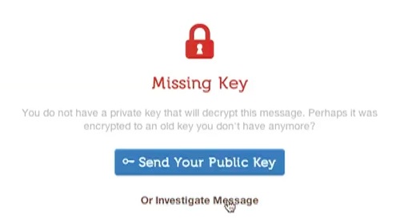

Encryption Flows
================

These UX flows exist to help applications implement a more standardized and better user experience of interacting with PGP and the numerous situations that arise.

## Can't Encrypt

There is the case where a user is trying to encrypt data and is unable to due to not having keys for all the intended receipients. In the case of being unable to encrypt, a tool SHOULD help the user figure out why this is and what can be done in order to encrypt.

* Offer UI feedback (colors & icons) that hint at why encrypting is not possible
* Explain the problem via clear and short status message
* Offer easy to perform actions to remove blocks
* * Provide auto key discovery via keyservers
* * Provide option to manually import key
* Offer UI feedback that signals once encryption is possible

## Can't Decrypt

When the case arises that PGP encrypted data CANNOT be decrypted by a user, the reasons being usually one of the following

#### Missing Key

This is perhaps the most common case user encounter, and the status message of **missingkey** is misleading, as what it means is the the receiver is "missing" one of the "keys" to which the data was encrypted. The most common real world scenario of this happening is that the sender used a key owned by the recipient that is either expired, revoked, or has lost the private key.

* Analyze the UID's of all the keys which data was encrypted to
* Compare UID's if any of these values match receivers current key
* * If yes, explain this to receiver
* Provide an easy method for receiver to send current key to sender

* Visual missing key UX in [Mailpile](https://mailpile.is8)*

Signature Flows
===============

## Can't Verify

There are various states of signatures whereby a user is presented with something less than ideal that appears to be scary. A good interface SHOULD present the user with each to follow actions to remedy these situations or at least clearly.

#### Unknown Signature

This case is relatively common and whereby a message was received with a PGP signature, but the receiver does not have the PGP public key that signed the message.

* Attempt to autodiscover key from servers
* Provide user action to manually go discover key
* Provide option to manually import key

PGP Keys Flows
==============

## Discovery

The discovery & search aspect of finding the public which a user is hoping to communicate with is a major pain point. Since keyservers are usually write/update only, often times expired, revoked or otherwise unsuable keys show up. Learning how to decipher which key is the best key (for a contact you are hoping engage with) is a dark art, and oftentimes nigh impossible.

#### Humanizing Search

* Name & email addresses are given priority in UI
* Avatars are preferable
* Hiding technical "key specific" details
* Provide clear "rating" score of keys

## Importing

The action of importing a key to a users keychain is often a major pain point with PGP. Most standalone PGP applications offer some sort of "Import" functionality. However, oftentime this stands on top of other components & tools such as the OS's filesystem and copying & pasting to a clipboard.

#### Inline PGP Keys

Due to the maleable nature of email messages as well as various PGP compontents (keys, attachments, etc...) there are many different occurances that diffing PGP implementations do in an attempt to improve things.

* Extract key data between `BEGIN PGP PUBLIC KEY BLOCK` and `END PGP PUBLIC KEY BLOCK`
* Replace with an actionable button to import key
* * If key is in keychain, explain this to user
* * If key is in keychain, offer other helpful 'actions' like inspect or forward key

#### Attached PGP Keys

* Offer simple import button that imports the key
* Differentiate this from other attachments