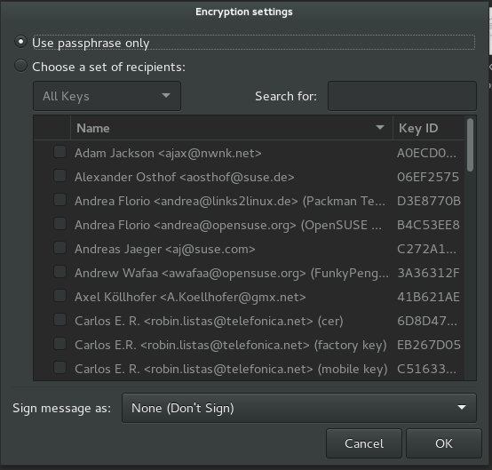

Encryption Flows
================

These flows exist to help applications implement standardized user experiences in respect to numerous situations that arise while successfully or unsuccessfully **encrypting** data to one or more public keys!

## Encrypt Message

Encrypting a message usually happens in a messsage composer or reply window as part of a larger messaging client.

- examples needed...

## Encrypt File

Encrypting a file is different from encrypting a message in that it is usually accessed via a file system, and thus is decoupled from the context of other messags or data. 

- 

*Encrypt file dialogue [Gnome](Encrypt file dialogue Gnome)*

## Can't Encrypt

There is the case where a user is trying to encrypt data and is unable to due to not having keys for all the intended receipients. In the case of being unable to encrypt, a tool SHOULD help the user figure out why this is and what can be done in order to encrypt.

* Offer UI feedback (colors & icons) that hint at why encrypting is not possible
* Explain the problem via clear and short status message
* Offer easy to perform actions to remove blocks
* * Provide auto key discovery via keyservers
* * Provide option to manually import key
* Offer UI feedback that signals once encryption is possible

